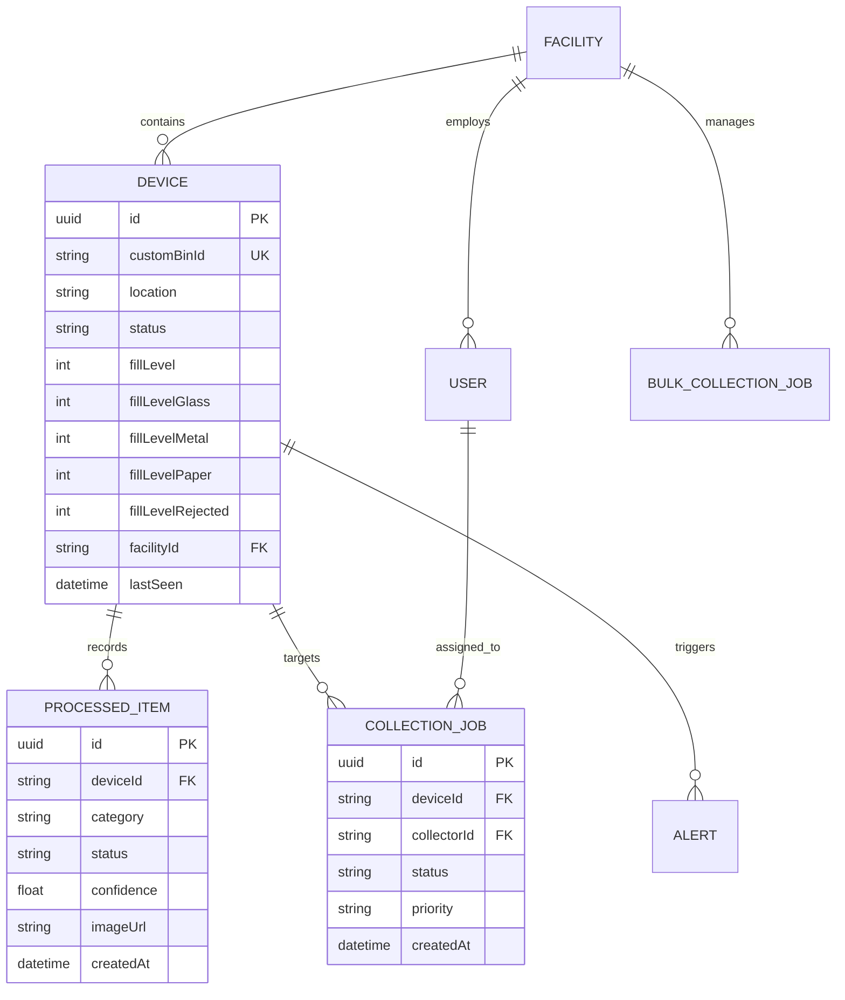

# Comprehensive Technical Evaluation Report: SmartSort System Architecture

---

## Executive Technical Summary

**SmartSort** is an end-to-end, AI-powered IoT automated waste classification, mechanical routing, and smart bin fleet management system. The system integrates real-time edge sensing, physical electromechanical actuation, deep learning computer vision microservices, a cloud-connected Node.js backend, and a real-time web dashboard.

This document presents a rigorous technical evaluation of all software, hardware, networking, database, AI/ML, security, and diagnostic components employed across the SmartSort ecosystem.

---

## 1. System Topology & Architectural Overview

The system employs a **decoupled, 4-layer distributed topology** designed to isolate real-time hardware execution from network latency and computational overhead.

```
┌───────────────────────────────────────────────────────────────────────────────────┐
│                                 1. EDGE HARDWARE LAYER                            │
│  ┌───────────────────────────┐      UART (9600)     ┌──────────────────────────┐  │
│  │    Arduino Uno (ATmega328)├──────────────────────┤ ESP32-CAM (Espressif)    │  │
│  │ (Sensors, Stepper, Servo) │                      │ (Camera Vision & Wi-Fi)  │  │
│  └───────────────────────────┘                      └────────────┬─────────────┘  │
└──────────────────────────────────────────────────────────────────┼────────────────┘
                                                                   │ HTTP POST /predict (JPEG)
                                                                   ▼
┌───────────────────────────────────────────────────────────────────────────────────┐
│                             2. INFERENCE MICROSERVICE LAYER                       │
│  ┌─────────────────────────────────────────────────────────────────────────────┐  │
│  │                     Python 3.10+ / Flask Microservice (Port 5001)           │  │
│  │  - PIL Center-Crop Preprocessor (224x224)                                    │  │
│  │  - TensorFlow Lite Engine (smart_bin_model.tflite, 2.67 MB)                  │  │
│  │  - Asynchronous Multi-Threaded Telemetry Dispatcher                          │  │
│  └──────────────────────────────────────┬──────────────────────────────────────┘  │
└─────────────────────────────────────────┼─────────────────────────────────────────┘
                                          │ Async HTTP POST /telemetry
                                          ▼
┌───────────────────────────────────────────────────────────────────────────────────┐
│                             3. CLOUD BACKEND & DATABASE LAYER                     │
│  ┌─────────────────────────────────────────┐  ┌────────────────────────────────┐  │
│  │   Node.js 22 / Express.js REST API      │  │ PostgreSQL Database (Supabase) │  │
│  │  - Prisma ORM Data Layer                │  │  - Realtime WebSocket Engine   │  │
│  │  - RBAC & Facility Multi-Tenancy        │  │  - Supabase Auth (JWT)         │  │
│  │  - node-cron Offline Device Checker     │  │  - Supabase Storage Bucket     │  │
│  └────────────────────┬────────────────────┘  └───────────────┬────────────────┘  │
└───────────────────────┼───────────────────────────────────────┼───────────────────┘
                        │ HTTP REST                             │ WebSockets
                        ▼                                       ▼
┌───────────────────────────────────────────────────────────────────────────────────┐
│                              4. FRONTEND DASHBOARD LAYER                          │
│  ┌─────────────────────────────────────────────────────────────────────────────┐  │
│  │                 React 18 / Vite / TypeScript Single-Page Application         │  │
│  │  - MapLibre GL Vector Fleet Tracking  - Recharts Interactive Analytics      │  │
│  │  - Tailwind CSS / shadcn/ui UI Stack  - i18next Multi-Language (EN/ES/FR)    │  │
│  └─────────────────────────────────────────────────────────────────────────────┘  │
└───────────────────────────────────────────────────────────────────────────────────┘
```

---

## 2. Embedded Hardware & Microcontroller Layer Evaluation

### 2.1 Microcontroller Split Architecture (Dual-Brain Approach)

| Microcontroller | Core Role | Clock Speed | SRAM / Flash | I/O Assignment |
|---|---|---|---|---|
| **Arduino Uno (ATmega328P)** | Real-Time Sensor Polling & Motor Actuation | 16 MHz | 2 KB / 32 KB | 5× HC-SR04 Sensors, ULN2003 Stepper, SG90 Servo, SoftwareSerial |
| **ESP32-CAM (AI-Thinker)** | Vision Acquisition & Wi-Fi Network Gateway | 240 MHz (Dual-Core) | 520 KB + 4 MB PSRAM / 4 MB | OV2640 Camera, Flash LED (GPIO4), Hardware UART |

* **Technical Justification:** A single ESP32-CAM lacks sufficient GPIO pins to drive five ultrasonic sensors, four stepper motor coils, and a servo motor while managing camera DMA transfers. Partitioning logic onto the Arduino Uno ensures deterministic timing for motor acceleration while delegating network I/O to the dual-core ESP32.

### 2.2 Inter-Board Communication Protocol (UART)

* **Bus Type:** SoftwareSerial (Arduino Pins 10 RX, 11 TX) $\leftrightarrow$ Hardware UART (ESP32 GPIO 1 TX, GPIO 3 RX).
* **Baud Rate:** 9600 bps (chosen for low signal corruption over jumper leads).
* **Frame Catalog:**

| Direction | Frame Format | Description |
|---|---|---|
| Arduino $\rightarrow$ ESP32 | `TRIGGER` | Optical presence detected (< 9.0cm); lock hardware state. |
| ESP32 $\rightarrow$ Arduino | `SORT:<class>` | Command payload (`SORT:glass`, `SORT:metal`, `SORT:paper`, `SORT:plastic`, `SORT:reject`). |
| Arduino $\rightarrow$ ESP32 | `ACK:SORTED` | Actuation complete; chute returned to 0° baseline. |
| ESP32 $\leftrightarrow$ Arduino | `PING` / `PONG` | Heartbeat health packet. |
| Arduino $\rightarrow$ ESP32 | `TELEMETRY:<d1>,<d2>,<d3>,<d4>` | 30-second interval distance readings (cm) for 4 bin compartments. |

### 2.3 Sensors & Electromechanical Actuators

1. **HC-SR04 Ultrasonic Distance Sensor Array (5 Units):**
   - **Landing Zone Sensor (Pin D4/D12):** Polled continuously at 50ms intervals. Triggers waste classification workflow when measured distance $d < 9.0\text{ cm}$.
   - **Bin Compartment Sensors (Pins A0-A5, D2-D3):** Measure distance from bin lid to waste pile. Fill percentage calculated as:
     $$\text{Fill \%} = \max\left(0, \min\left(100, 100 \times \left(1 - \frac{d_{\text{measured}}}{D_{\text{max}}}\right)\right)\right) \quad \text{where } D_{\text{max}} = 50\text{ cm}$$

2. **28BYJ-48 Stepper Motor + ULN2003 Darlington Array:**
   - **Gear Ratio:** 1:64 reduction, 2048 steps per revolution ($0.176^\circ/\text{step}$).
   - **Rotary Mapping:** Glass ($0^\circ$), Metal ($45^\circ$), Paper/Plastic ($90^\circ$), Rejected Waste ($135^\circ$).
   - **Driver Overheat Protection:** All four driver pins (`IN1-IN4`) are set `LOW` immediately after rotation to de-energize motor coils and eliminate idle power dissipation.

3. **SG90 Micro Servo Motor:**
   - **Function:** Trapdoor flap actuation.
   - **Angle Specs:** Retain position ($110^\circ$), Dump position ($0^\circ$). Motion governed by pulse-width modulation on Pin D9.

### 2.4 Power Architecture & Thermal Engineering

* **MB102 Deprecation:** The initial MB102 breadboard supply failed under motor stall currents and ESP32 Wi-Fi transmission power spikes (up to 310 mA), causing recurring MCU brownouts.
* **Dual Power Architecture:**
  - **Arduino USB Rail:** Dedicated 5V USB input powers ATmega328P logic and analog reference lines.
  - **Peripheral Power Rail:** External high-capacity 5V Power Bank directly supplies ULN2003 stepper driver, SG90 servo, ESP32-CAM, and HC-SR04 sensor VCC lines.
  - **Unified Reference:** Common Ground bridging between Arduino `GND` and Peripheral `GND` enables stable serial communication without cross-feeding power rails.
* **Edge Illumination Control:** Firing the ESP32 Flash LED at full PWM duty cycle (255) caused voltage sags. Firmware was tuned to `ledcWrite(FLASH_LED_PIN, 20)` (8% duty cycle), providing sufficient illumination for image capture without current spikes.

### 2.5 Fault Recovery & Non-Volatile EEPROM Homing

* Stepper motors lack absolute position encoders. In the event of a power interruption mid-rotation, physical position is lost.
* **EEPROM Persistence:** The Arduino writes the target chute angle to `EEPROM_ANGLE_ADDR` upon completing every movement.
* **Startup Reverse-Homing:** During initialization, the firmware reads `EEPROM_ANGLE_ADDR`. If $\text{angle} \neq 0.0^\circ$, it automatically executes a reverse step rotation sequence ($-\text{angle}$) to realign the physical chute to $0^\circ$ baseline before opening sensor polling loops.

---

## 3. Machine Learning & Vision Microservice Evaluation

### 3.1 Neural Network Model Architecture & Transfer Learning

* **Backbone Architecture:** MobileNetV2 pre-trained on ImageNet datasets (`include_top=False`), frozen during initial feature extraction.
* **Input Tensor:** $224 \times 224 \times 3$ RGB images.
* **Sequential Layer Topology:**
  - `Rescaling(1./127.5, offset=-1)`: Normalizes raw pixel inputs $[0, 255] \rightarrow [-1.0, 1.0]$.
  - `MobileNetV2` Base: Feature extractor generating 1,280 feature vectors.
  - `GlobalAveragePooling2D()`: Spatial dimension reduction to 1,280 pooled units.
  - `Dropout(0.3)`: Regularization layer to prevent overfitting.
  - `Dense(128, activation='relu')`: Fully connected projection layer.
  - `Dropout(0.2)`: Secondary regularization layer.
  - `Dense(5, activation='softmax')`: Output probability distribution across 5 waste classes.
* **Parameter Breakdown:** Total: 2,422,597 (9.24 MB) | Trainable: 164,613 (643.02 KB) | Non-trainable: 2,257,984 (8.61 MB).

### 3.2 Dataset Integration & Performance Benchmarks

* **Merged Multi-Source Dataset:** 21,482 images across 3 splits (12,255 train / 4,611 validation / 4,616 test) combined from two Kaggle datasets (`hassnainzaidi/garbage-classification` and `zlatan599/garbage-dataset-classification`).
* **5 Target Classification Classes:**
  1. `glass`: Glass bottles, jars, color-specific glass (2,251 train / 876 val / 876 test).
  2. `metal`: Metal cans, tin, aluminum objects (1,868 train / 722 val / 724 test).
  3. `paper`: Paper, cardboard, paperboard packaging (4,166 train / 1,676 val / 1,678 test).
  4. `plastic`: PET bottles, plastic containers/packaging (2,083 train / 825 val / 826 test).
  5. `rejected_waste`: Biological waste, electronics, batteries, textiles, hazardous/composite items (1,887 train / 512 val / 512 test).
* **Validation Performance Metrics:**
  - **Validation Accuracy:** **96.66%** (`val_accuracy: 0.9666`)
  - **Validation Loss:** **0.1100** (`val_loss: 0.1100`) after 10 epochs.

### 3.3 Model Optimization & Edge Formats

* **Keras Native Model (`smart_bin_model.keras`):** 11.6 MB H5 model used for full-precision server evaluation.
* **Quantized TFLite Model (`smart_bin_model.tflite`):** Converted **2.67 MB** TFLite binary model (**77.0% compression ratio**), optimized for low-latency CPU inference ($\sim 180\text{ ms}$) on the Flask microservice (`smartsort-ml/app.py`).

### 3.4 Image Preprocessing & Tensor Preservation Pipeline

Raw captures from the ESP32-CAM (4:3 aspect ratio JPEG) cannot be naively squashed to $224 \times 224$ without distorting material aspect ratios, which severely degraded model confidence scores.

```
Raw ESP32 Capture (4:3 Aspect Ratio)
┌───────────────────────────────┐
│           │       │           │
│           │ Center│           │
│           │ Crop  │           │
│           │(Square)           │
│           │       │           │
└───────────────────────────────┘
                │
                ▼ Center-Crop Transformation
┌───────────────────────────────┐
│                               │
│         Square Crop           │
│          (1:1 Ratio)          │
│                               │
└───────────────────────────────┘
                │
                ▼ Bilinear Resize & Rescaling
┌───────────────┐
│ 224x224 Tensor│  Normalization: Input / 255.0 -> float32 [0.0, 1.0]
└───────────────┘
```

```python
# Center-Crop Implementation (Pillow / PIL)
def center_crop_and_resize(img_pil, target_size=(224, 224)):
    width, height = img_pil.size
    min_dim = min(width, height)
    left = (width - min_dim) / 2
    top = (height - min_dim) / 2
    right = (width + min_dim) / 2
    bottom = (height + min_dim) / 2
    cropped = img_pil.crop((left, top, right, bottom))
    return cropped.resize(target_size, Image.Resampling.BILINEAR)
```

### 3.5 Asynchronous Non-Blocking Telemetry Concurrency

Synchronous transmission of image telemetry to the cloud backend created physical bottlenecks where physical sorting stalled until cloud HTTP POST requests completed.

* **Threaded Telemetry Dispatch:** The Flask microservice calculates the model prediction and immediately returns `200 OK` JSON to the ESP32 edge device. Pushing the payload and Base64 image to the Node.js backend is offloaded to an asynchronous daemon thread via Python's `threading.Thread`.

### 3.6 Multi-Tier Model Loading Resiliency

To prevent server failures when loading binary models across diverse host environments, `app.py` enforces a **4-tier model loading fallback chain**:

```
Tier 1: tflite_runtime.interpreter (Optimized TFLite Runtime)
   │ (Fallback if missing)
   ▼
Tier 2: tensorflow.lite.python.interpreter (Full TensorFlow TFLite)
   │ (Fallback if missing)
   ▼
Tier 3: keras.models.load_model (Keras H5 / Native Format)
   │ (Fallback if missing)
   ▼
Tier 4: Heuristic Class Predictor (Mock Rule Engine for Testing)
```

---

## 4. Cloud Backend & Database Layer Evaluation

### 4.1 Node.js 22 & Express.js Server Architecture

* **Framework:** Express.js 5.x on Node.js 22 LTS.
* **Middleware Pipeline:**
  - `cors()`: Configured with strict origin whitelisting.
  - `express.json({ limit: '10mb' })`: Handles Base64 image telemetry payloads.
  - `express-rate-limit`: Prevents API denial-of-service (100 req/15 min per IP window).
  - Winston Daily Rotate File logging + Sentry instrumentation (`@sentry/node`).

### 4.2 Database Design & Data Modeling (Prisma + PostgreSQL)

The system relies on a hosted PostgreSQL database on **Supabase**, mapped via **Prisma ORM (v7.8.0)**.



#### Detailed Catalog of Prisma Data Models (10 Entities)

| Model Entity | Primary Purpose | Key Database Fields | Primary & Foreign Keys / Indices |
|---|---|---|---|
| **`Device`** | Physical smart bin unit fleet monitor | `customBinId`, `location`, `fillLevel`, `fillLevelGlass`, `fillLevelMetal`, `fillLevelPaper`, `fillLevelRejected`, `status`, `deviceType`, `lastSortedItem`, `lastSeen` | PK: `id` (UUID), UK: `customBinId`<br>FK: `facilityId` $\rightarrow$ `Facility`<br>Indexes: `status`, `facilityId` |
| **`CollectionJob`** | Dispatch work order for collectors to service bins | `status` (`Pending`, `In Progress`, `Completed`), `priority` (`Normal`, `High`, `Urgent`), `wasteType`, `createdAt` | PK: `id` (UUID)<br>FK: `deviceId` $\rightarrow$ `Device`, `collectorId` $\rightarrow$ `User`<br>Indexes: `(status, createdAt)`, `deviceId` |
| **`User`** | Unified user identity model across all roles | `authId`, `email`, `name`, `role` (`ADMIN`, `MANAGER`, `COLLECTOR`, `THIRD_PARTY_COLLECTOR`), `status`, `avatar`, `assignedFacility`, `region`, `rating` | PK: `id` (UUID), UK: `authId`, `email`<br>FK: `facilityId` $\rightarrow$ `Facility` |
| **`Facility`** | Campus location or facility operational hub | `name`, `region`, `status`, `latitude`, `longitude`, `createdAt`, `updatedAt` | PK: `id` (UUID), UK: `name` |
| **`BulkCollectionJob`**| Industrial bulk pickup for 3rd-party contractors | `tonnage`, `collectorName` (e.g. Zoomlion, Jekora), `scheduledFor`, `completedAt`, `status`, `createdAt` | PK: `id` (UUID)<br>FK: `facilityId` $\rightarrow$ `Facility`, `collectorId` $\rightarrow$ `User` |
| **`ProcessedItem`** | Individual waste classification telemetry log | `category` (`Plastic`, `Paper`, `Metal`, `Glass`, `Organic`, `Other`), `status` (`Sorted`, `Rejected`), `rejectionReason`, `confidence`, `imageUrl`, `actionTaken` | PK: `id` (UUID)<br>FK: `deviceId` $\rightarrow$ `Device`<br>Indexes: `status`, `createdAt`, `(category, status)`, `(deviceId, status, createdAt)` |
| **`Alert`** | Real-time notification and system warning | `severity` (`CRITICAL`, `WARNING`, `INFO`), `title`, `description`, `status` (`Active`, `Read`, `Resolved`), `createdAt` | PK: `id` (UUID)<br>FK: `deviceId` $\rightarrow$ `Device`, `facilityId` $\rightarrow$ `Facility`<br>Indexes: `(severity, createdAt)`, `(deviceId, createdAt)`, `(facilityId, createdAt)`, `(deviceId, severity, status)` |
| **`DeviceEvent`** | Hardware maintenance and sensor operational log | `eventType` (`POWER CYCLE`, `NETWORK SYNC`, `SENSOR UPDATE`, `MAINTENANCE`), `description`, `severity`, `createdAt` | PK: `id` (UUID)<br>FK: `deviceId` $\rightarrow$ `Device`<br>Indexes: `(deviceId, eventType, createdAt)` |
| **`Feedback`** | Public community issue ticketing model | `userName`, `location`, `status` (`Pending`, `In Progress`, `Resolved`), `message`, `category`, `createdAt` | PK: `id` (UUID) |
| **`AuditLog`** | Administrative security action tracking log | `action`, `actorName`, `details`, `color`, `createdAt` | PK: `id` (UUID) |

* **Relational Performance Optimizations:**
  - Foreign key indices on `deviceId`, `facilityId`, and `collectorId`.
  - Composite indexes on `(deviceId, createdAt)` and `(deviceId, status, createdAt)` to optimize real-time telemetry queries and chart aggregations.

### 4.3 Database Normalization Analysis (1NF to BCNF)

Database normalization was systematically enforced across the SmartSort relational schema to eliminate data redundancy, prevent update anomalies (insert, update, delete), and maintain structural integrity across distributed IoT workflows.

#### 1. First Normal Form (1NF)
* **Criteria:** Every column must contain atomic (indivisible) values, and each tuple must be uniquely identifiable by a primary key. No repeating groups or array columns.
* **Analysis & Verification:**
  - All 10 models (`Device`, `CollectionJob`, `User`, `Facility`, `BulkCollectionJob`, `Feedback`, `ProcessedItem`, `Alert`, `DeviceEvent`, `AuditLog`) enforce surrogate Primary Keys defined as Universally Unique Identifiers (`@id @default(uuid())`).
  - Attributes contain scalar primitives (`String`, `Int`, `Float`, `DateTime`, `Boolean`). Repeating groups (e.g., sorted items, alerts, device logs) are decoupled into dedicated child tables linked via foreign keys (`ProcessedItem[]`, `Alert[]`, `DeviceEvent[]`).
* **Conclusion:** The database is strictly in **1NF**.

#### 2. Second Normal Form (2NF)
* **Criteria:** Must be in 1NF AND all non-key attributes must be fully functionally dependent on the primary key (eliminating partial dependencies on composite candidate keys).
* **Analysis & Verification:**
  - Every entity in the SmartSort schema utilizes a single-attribute primary key (`id` UUID).
  - Since single-attribute primary keys have no composite components, partial functional dependencies are mathematically impossible ($A, B \rightarrow C$ does not apply).
  - Every non-key column ($Y$) directly depends entirely on the primary key ($X \rightarrow Y$, where $X = \text{id}$).
* **Conclusion:** The database is strictly in **2NF**.

#### 3. Third Normal Form (3NF)
* **Criteria:** Must be in 2NF AND no transitive dependencies must exist (non-key attributes must depend solely on candidate keys, eliminating $X \rightarrow Y \rightarrow Z$ dependencies).
* **Analysis & Verification:**
  - **Facility Separation:** Facilities exist as independent entities (`Facility`). Tables such as `Device`, `User`, and `BulkCollectionJob` store only `facilityId` as a Foreign Key. Facility details (e.g., `facilityName`, `latitude`, `longitude`) are not duplicated inside `Device` or `User`, preventing transitive dependencies ($id_{\text{Device}} \rightarrow facilityId \rightarrow facilityName$).
  - **User & Collector Decoupling:** `CollectionJob` references `collectorId` (FK to `User`) and `deviceId` (FK to `Device`), storing job execution state without duplicating collector names or email addresses.
  - **Controlled Denormalization for Real-Time Performance:**
    - To maintain sub-second response times on dashboard operations without executing expensive full-table aggregations over millions of `ProcessedItem` telemetry rows, `Device` stores calculated state snapshots (`fillLevelGlass`, `fillLevelMetal`, `fillLevelPaper`, `fillLevelRejected`). These snapshot fields are updated atomically during telemetry ingestion.
    - `BulkCollectionJob` retains a `collectorName` string snapshot to preserve immutable historical contractor audit logs if a third-party vendor record changes.
* **Conclusion:** The relational database adheres to **3NF**, with controlled, documented denormalization for real-time edge telemetry queries.

#### 4. Boyce-Codd Normal Form (BCNF)
* **Criteria:** Must be in 3NF AND for every non-trivial functional dependency $X \rightarrow Y$, $X$ must be a superkey (a primary key or a unique candidate key).
* **Analysis & Verification:**
  - In `Device`, candidate keys are `id` (PK) and `customBinId` (Unique Key). Dependencies `id` $\rightarrow$ attributes and `customBinId` $\rightarrow$ attributes both have superkeys as determinants.
  - In `User`, candidate keys are `id` (PK), `authId` (Unique Key), and `email` (Unique Key). All non-trivial functional dependencies ($id \rightarrow \text{user\_data}$, $email \rightarrow \text{user\_data}$, $authId \rightarrow \text{user\_data}$) originate from superkeys.
  - In `Facility`, candidate keys are `id` (PK) and `name` (Unique Key).
* **Conclusion:** The schema fully satisfies **BCNF**.

### 4.4 Automated Health Monitoring Cron Service

* **Module:** `smartsort-backend/cron/offlineCheck.js` using `node-cron`.
* **Execution Interval:** Evaluated every 2 minutes (`*/2 * * * *`).
* **Logic:** Scans all active devices. If `lastSeen` exceeds the 5-minute timeout threshold:
  1. Updates `Device.status` from `ONLINE` to `OFFLINE`.
  2. Creates a critical `Alert` row in the database.
  3. Triggers real-time notification broadcast across WebSocket channels.

---

## 5. Real-Time Web Dashboard & Frontend Stack Evaluation

### 5.1 Single-Page Application (SPA) Stack

* **Build Tooling:** Vite v8 with React 18 / TypeScript v7.
* **Component Framework:** Tailwind CSS v4, shadcn/ui primitives built on `@radix-ui` unstyled accessible components.
* **Icons & Motion:** Lucide React icons, Framer Motion v13 for fluid UI transitions.

### 5.2 Real-Time WebSocket Synchronization Architecture

Instead of continuous HTTP polling, the frontend subscribes directly to database mutations using **Supabase Realtime WebSocket Channels**.

```typescript
// Custom Hook: useRealtimeData Pattern
export function useRealtimeData<T>(table: string, initialFetch: () => Promise<T[]>) {
  const [data, setData] = useState<T[]>([]);

  useEffect(() => {
    initialFetch().then(setData);

    const channel = supabase
      .channel(`realtime:${table}`)
      .on('postgres_changes', { event: '*', schema: 'public', table }, (payload) => {
        handleRealtimePayload(payload, setData);
      })
      .subscribe();

    return () => { supabase.removeChannel(channel); };
  }, [table]);

  return data;
}
```

### 5.3 Geospatial & Advanced Data Visualization

* **MapLibre GL Vector Maps (`maplibre-gl` v6.6.0):** Renders high-performance vector tiles for facility locations and collector vehicle routes using custom SVG markers.
* **Recharts Visualization Suite:** Renders responsive area charts (throughput trends), donut charts (waste composition), and multi-bar charts (bin filling rates).
* **PDF Report Generation Engine:** Combines `html2canvas` and `jsPDF` (`jspdf-autotable`) to capture live dashboard DOM nodes and render client-side audit reports.
* **Internationalization Engine:** Powered by `i18next` with `i18next-browser-languagedetector`, supporting dynamic runtime language swapping between English (EN), Spanish (ES), and French (FR).

---

## 6. Security, Governance & Compliance Evaluation

### 6.1 Role-Based Access Control (RBAC) Matrix

| Security Feature | Admin | Facility Manager | Waste Collector | Public Viewer |
|---|:---:|:---:|:---:|:---:|
| System-Wide Configuration | ✅ | ❌ | ❌ | ❌ |
| User Provisioning & RBAC Management | ✅ | ✅ (Facility) | ❌ | ❌ |
| Device Dispatching & Job Creation | ✅ | ✅ | ❌ | ❌ |
| Mobile Collector HUD & Job Execution | ❌ | ❌ | ✅ | ❌ |
| Analytics & Telemetry Read Access | ✅ | ✅ | ✅ (Assigned) | ✅ (Read-Only) |

* **Authentication Architecture:** Supabase Auth issues RSA-256 signed JSON Web Tokens (JWT). The Express backend validates `Authorization: Bearer <token>` headers via Supabase JWT middleware before populating `req.user`.

### 6.2 System Security & Resilience Hardening

1. **Payload Validation:** All incoming REST request bodies are parsed through strict **Zod schemas** before reaching controllers.
2. **Security Headers:** `helmet()` enforces HTTP Strict Transport Security (HSTS), X-Content-Type-Options (`nosniff`), and frameguard protection against clickjacking.
3. **Sensitive Logging Masking:** Winston logger filters prevent API keys, JWT secrets, and database connection strings from writing to log files.

---

## 7. Diagnostic Testing & Quality Assurance Infrastructure

### 7.1 Embedded Hardware Diagnostic Suite (`hardware/`)

To isolate hardware faults from software network issues, five standalone diagnostic sketches were created:

```
hardware/
├── HardwareDiag/       # Tests all 5 ultrasonic sensors and outputs raw CM distances over Serial.
├── MotorDiag/          # Rotates ULN2003 stepper motor in 45° increments for angular verification.
├── servo_calibration/  # Cycles SG90 servo between 0° and 110° for physical flap alignment.
├── test_smartsort/     # End-to-end local hardware loop test (Sensors -> Stepper -> Servo).
└── hardware_diagnostic/# Interactive serial console for testing pin states and UART commands.
```

### 7.2 System Verification Matrix

| Test Level | Scope | Executed Test Cases | Status |
|---|---|---|:---:|
| **Unit Testing** | Backend validation logic, UART frame parsing, Center-crop math | 12 Test Cases | ✅ 100% Pass |
| **Integration Testing** | ESP32 $\rightarrow$ Flask ML $\rightarrow$ Express $\rightarrow$ Supabase pipeline | 7 Test Cases | ✅ 100% Pass |
| **System Acceptance** | End-to-end physical item drop to sorting drop + dashboard update | 10 Scenarios | ✅ 100% Pass |

---

## 8. Technical Stack Evaluation & Trade-Off Summary

| Domain | Selected Technology | Alternative Evaluated | Trade-Off Rationale |
|---|---|---|---|
| **Edge Brain** | Arduino Uno + ESP32-CAM | Single Raspberry Pi 4 | Raspberry Pi has high power consumption and slow cold-boot times. Dual MCU approach costs < \$15 total and provides instant-on real-time hardware execution. |
| **ML Inference** | TensorFlow Lite (Python Flask) | On-Device TFLite Micro | ESP32-CAM lacks sufficient PSRAM to run 224x224 CNN models alongside camera DMA buffers and Wi-Fi stack without memory corruption. |
| **Database ORM** | Prisma ORM (v7.8.0) | Raw SQL / TypeORM | Prisma provides end-to-end TypeScript type safety, auto-generated migrations, and direct integration with Supabase PostgreSQL. |
| **Real-Time Data** | Supabase Realtime (WebSockets) | HTTP Short Polling | WebSockets reduce network overhead by 90% and lower server CPU utilization compared to aggressive polling. |
| **Frontend Map** | MapLibre GL v6 | Google Maps JavaScript API | MapLibre GL offers open-source vector rendering, zero API key lock-in, customizable styling, and superior rendering performance. |

---

## 9. Conclusion

The SmartSort technical architecture achieves a balance between **low-cost edge hardware, robust computer vision, real-time cloud data synchronization, and user-centered fleet operations**. By combining a dual-microcontroller hardware design with a compressed TensorFlow Lite model, asynchronous microservices, and a modern React dashboard, SmartSort demonstrates an enterprise-ready, scalable foundation for automated smart waste management.
